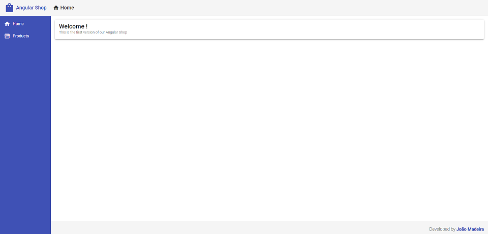
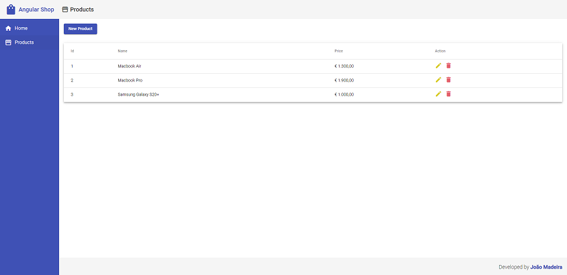
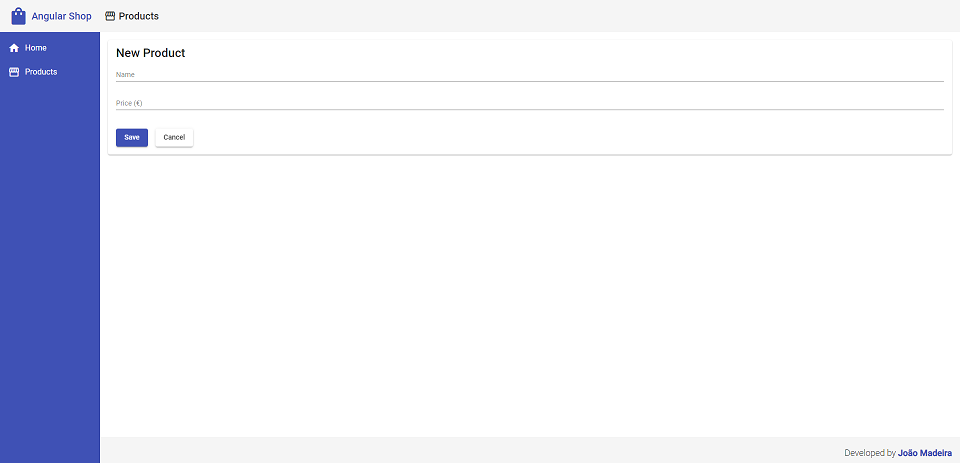
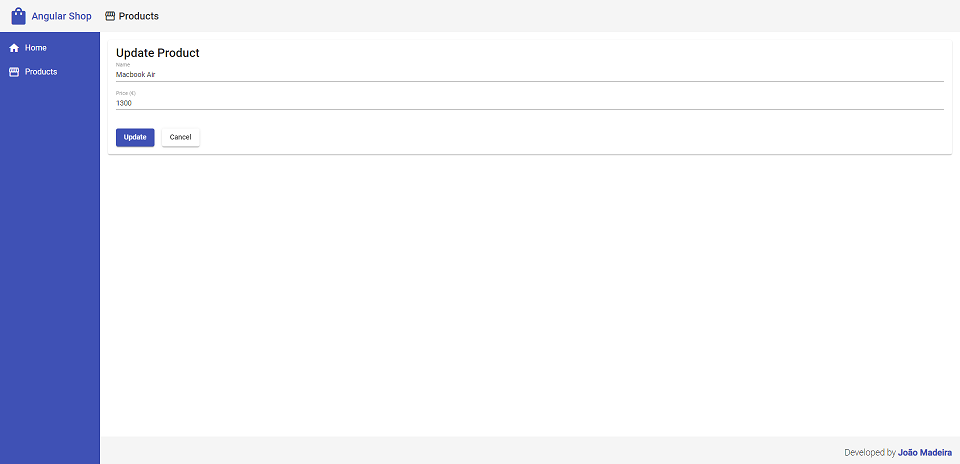
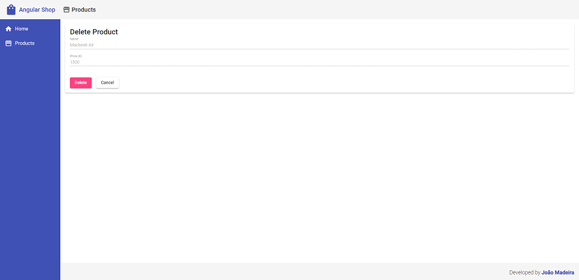

# Angular Shop v1

This is a project developed with the purpose of improving my knowledge in Angular using is principal concepts.

Angular Shop v1, is the first version of an online store, where at the moment it is possible to create, read, update and delete products.

## :camera: Preview







## :hammer: Setup

### Backend

Mocked REST API made with JSON server, to provide data that will be used by the frontend.

```bash
# Navigate to the backend folder
cd server

# To install all project dependencies
npm install

# To run the application
npm start
```

---

#### Frontend

Application made entirely in Angular, which uses a REST API provided by the server.

```bash
# Navigate to the frontend folder
cd web

# To install all project dependencies
npm install

# To run the application
ng serve
```

## :computer: Development dependencies

**Server**

- json-server

**Frontend**

- angular
- angular/material

## :soon: Upcoming Features

- [ ] Role based authentication
- [ ] Shopping cart
